# Diagramas Completos do Sistema (BPMN, UML e Banco de Dados)

Este documento consolida **todos os tipos principais de diagramas possíveis** para documentação de software no contexto deste projeto.

## 1) BPMN (Business Process Model and Notation)

### 1.1 BPMN — Cadastro e autenticação
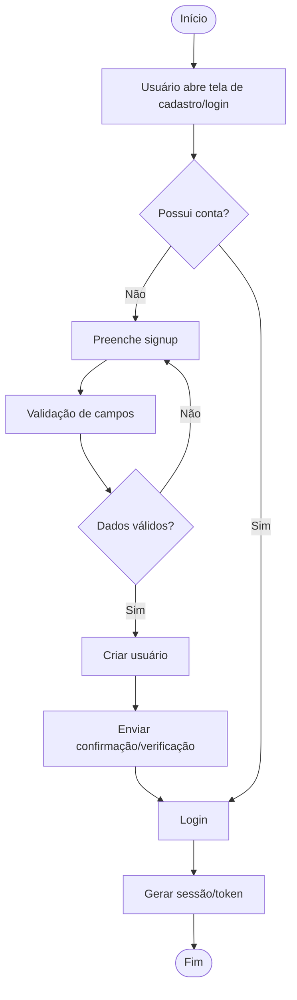

### 1.2 BPMN — Adição e processamento de peça do guarda-roupa
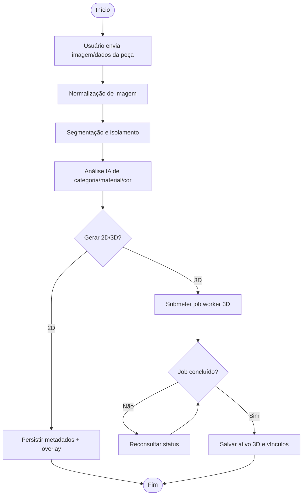

### 1.3 BPMN — Criação de esquema/look
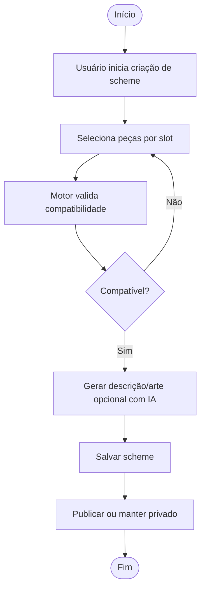

### 1.4 BPMN — Busca e descoberta
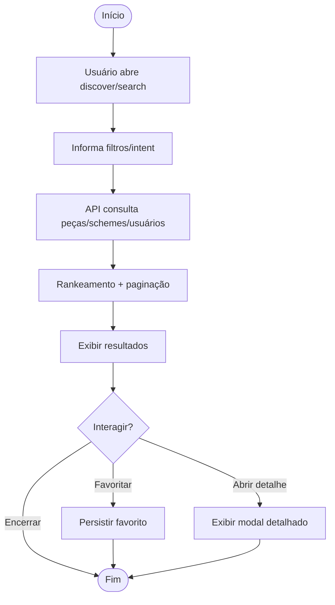

## 2) UML — Diagramas possíveis

### 2.1 Diagrama de Casos de Uso
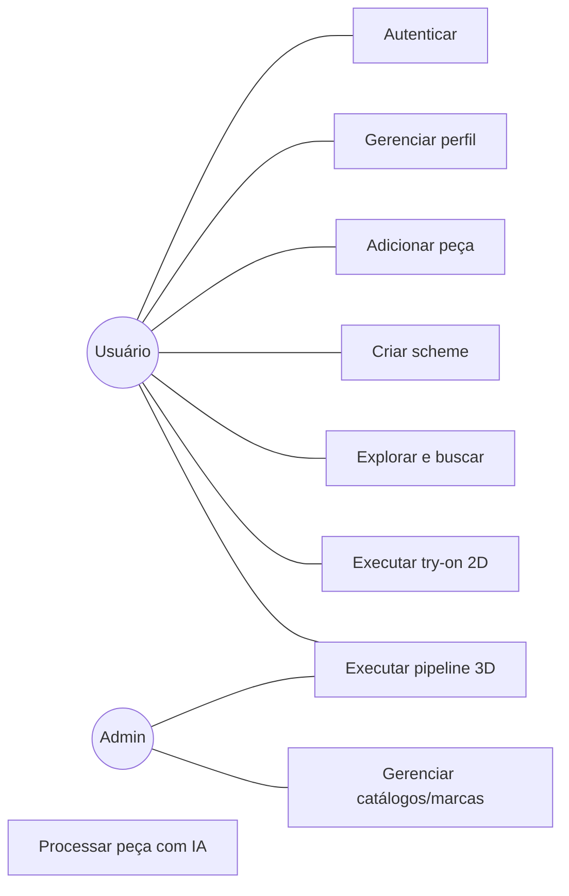

### 2.2 Diagrama de Atividades — Try-on 2D
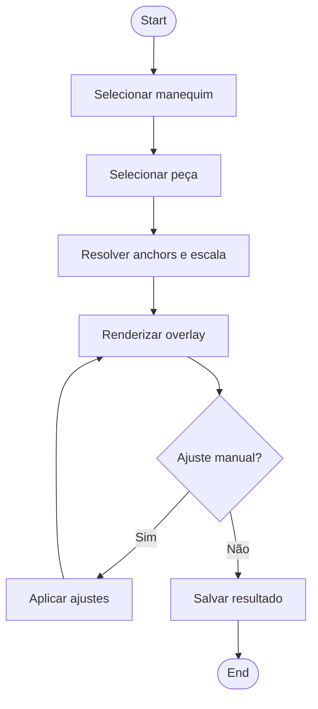

### 2.3 Diagrama de Sequência — Upload de peça
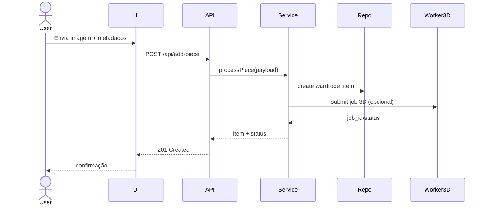

### 2.4 Diagrama de Estados — Pipeline 3D
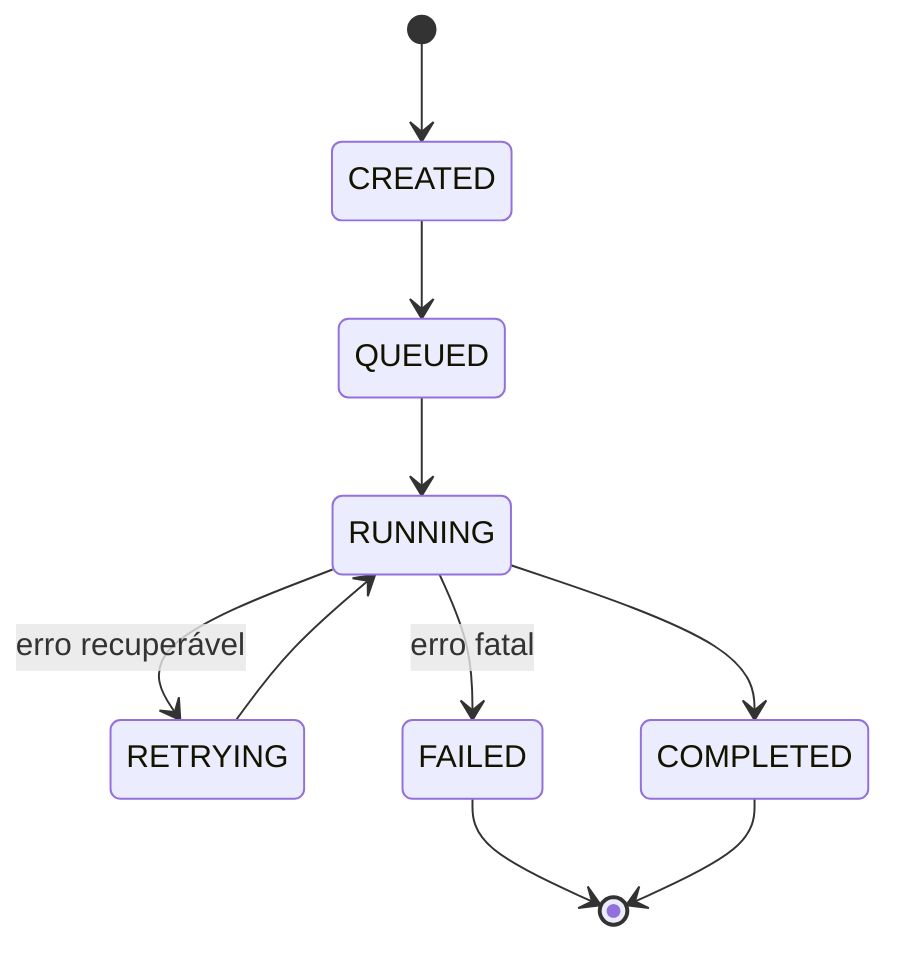

### 2.5 Diagrama de Componentes
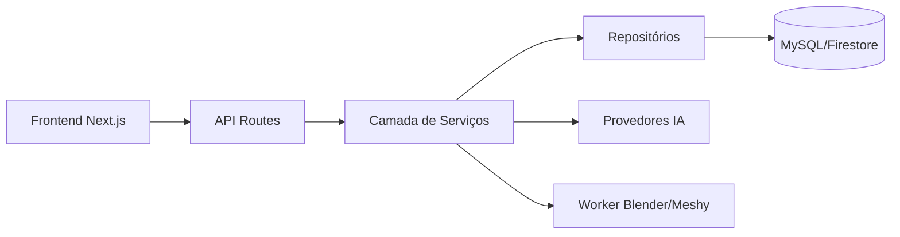

### 2.6 Diagrama de Implantação
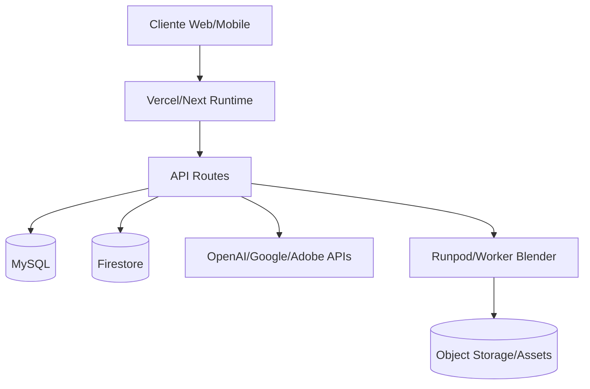

## 3) Diagrama Lógico-Relacional de Banco de Dados

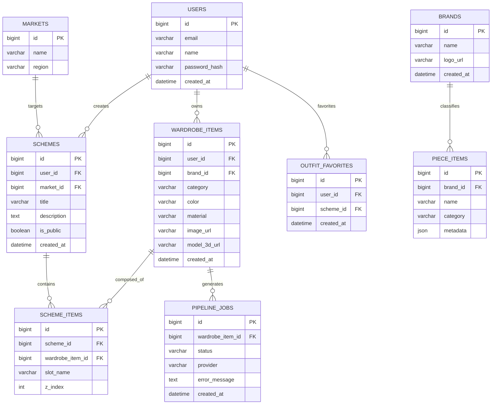

## 4) Diagrama de Classes do Sistema

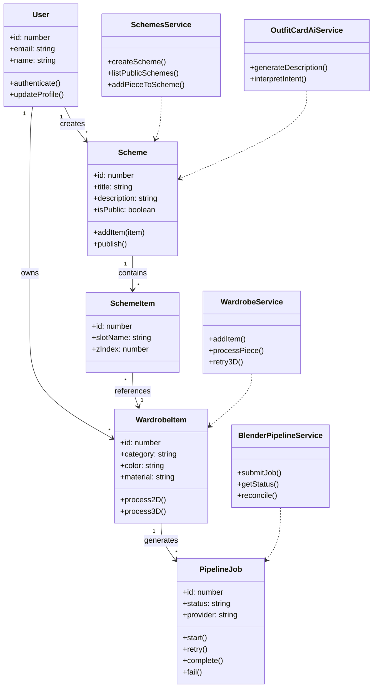

## 5) Observações
- Estes diagramas estão em formato Mermaid para versionamento no Git e fácil manutenção.
- Caso queira, posso também gerar versões em `.drawio` e/ou `.bpmn` separadas por processo.
