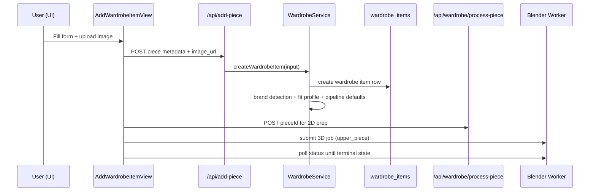
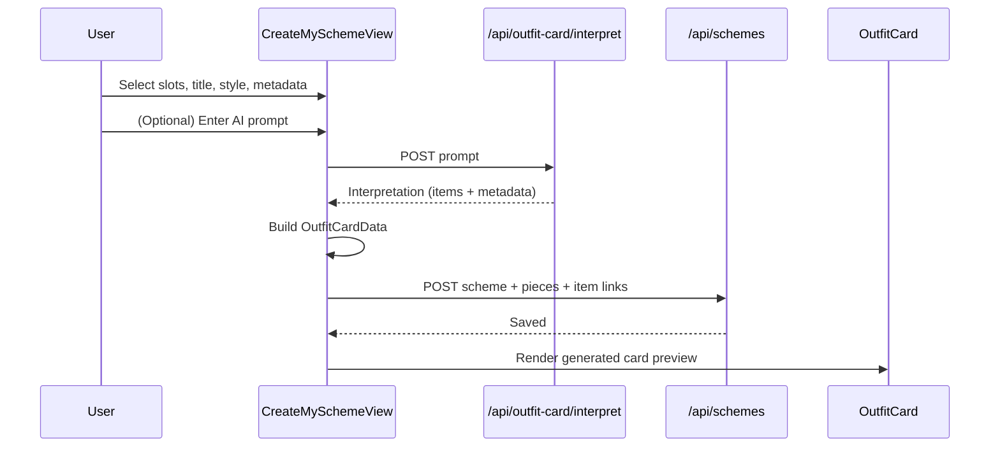
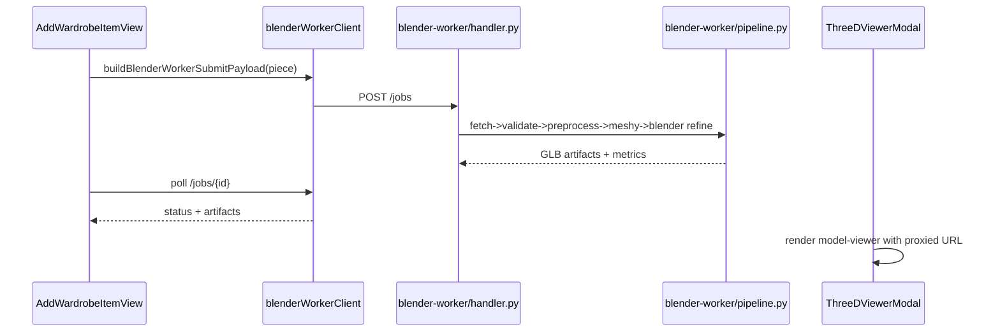

# Main Activity Workflows (Wardrobe Piece, Outfit Card, 3D Pipeline)

This document maps the **end-to-end workout** of three core activities in SAI:

1. Creating a new wardrobe piece.
2. Creating and saving an outfit card.
3. Visualizing and processing the 3D pipeline.

It also includes **key code snippets** and clear sequence maps so contributors can quickly trace where data starts, transforms, and lands.

---

## 1) Create a New Wardrobe Piece

### High-level sequence



### Frontend orchestration (`AddWardrobeItemView`)

The main submit flow does three things in order:
1. Creates the piece in the app backend.
2. Triggers internal 2D processing.
3. Schedules/polls a 3D worker job for upper pieces.

```ts
const response = await fetch('/api/add-piece', {
  method: 'POST',
  headers: { 'Content-Type': 'application/json' },
  body: JSON.stringify({
    user_id: userId,
    ...form,
    brand_id: form.brand_id || DEFAULT_BRAND_ID,
    style_tags: form.style_tags.split(',').map((tag) => tag.trim()).filter(Boolean),
    occasion_tags: form.occasion_tags.split(',').map((tag) => tag.trim()).filter(Boolean),
  }),
});

if (createdWardrobeItemId) {
  await fetch('/api/wardrobe/process-piece', {
    method: 'POST',
    headers: { 'Content-Type': 'application/json' },
    body: JSON.stringify({ pieceId: createdWardrobeItemId }),
  });
}

if (createdWardrobeItemId && form.piece_type === 'upper_piece') {
  const submitPayload = buildBlenderWorkerSubmitPayload({
    wardrobe_item_id: createdWardrobeItemId,
    name: form.name,
    piece_type: form.piece_type,
    image_url: form.image_url,
  });
  const submitResponse = await submitBlenderWorkerJob(submitPayload);
  setUvJobId(String(submitResponse.jobId ?? submitResponse.job_id ?? submitResponse.id ?? '').trim());
}
```

### Backend creation + enrichment (`WardrobeService`)

The service validates required fields, resolves brand detection, seeds a robust `fitProfile`, persists the row, then optionally starts enrichment.

```ts
if (!user_id || !name || !image_url || !piece_type || !market_id) {
  throw new ServiceError('Missing required fields to create wardrobe item.', 400);
}

const detection = await this.brandDetectionService.detect({
  selectedBrandId,
  name,
  imageUrl: image_url,
});

const createdItem = await this.wardrobeRepo.create({
  user_id,
  name,
  image_url,
  model_status: needsBrandReview ? 'needs_brand_review' : 'queued_segmentation',
  brand_id: resolvedBrandId,
  brand_id_selected: selectedBrandId,
  brand_id_detected: detection.brand_id_detected,
  fitProfile: {
    pieceType: fitPieceType,
    targetGender: fitGender,
    preparationStatus: 'pending',
    originalImageUrl: image_url,
    compatibleMannequins,
    fitMode: 'overlay',
    updatedAt: new Date().toISOString(),
  },
});

if (!needsBrandReview) {
  await this.enrichWardrobeItemModel({
    wardrobeItemId: createdItem.wardrobe_item_id,
    imageUrl: image_url,
    pieceType: piece_type,
    brandId: resolvedBrandId,
  });
}
```

### Clarifying notes
- `style_tags` and `occasion_tags` are CSV strings in UI, normalized to string arrays before API call.
- The 2D processing call is decoupled from initial creation, so piece creation can succeed even if preparation fails.
- 3D submission is currently conditional (`upper_piece`), and the UI stores `uvJobId/uvJobStatus` for live updates.

---

## 2) Create + Save an Outfit Card

### High-level sequence



### Build card payload (`buildGeneratedOutfitCardData`)

The card builder maps slots to normalized `OutfitPiece[]`, resolves brand data, and selects description mode.

```ts
const pieces = (Object.keys(slots) as SlotKey[])
  .map((slot) => {
    const selectedValue = slots[slot];
    if (!selectedValue) return null;

    const inventoryItem = items.find((item) => item.wardrobe_item_id === selectedValue);
    const suggestedItem = DEFAULT_SLOT_SUGGESTIONS[slot].find((suggestion) => suggestion.value === selectedValue);

    return {
      id: selectedValue,
      name: inventoryItem?.name || suggestedItem?.label || `${formatDisplayName(slot)} Piece`,
      brand: slotBrandName,
      brandLogoUrl: resolveBrandLogoUrlByName(slotBrandName) || resolvedSlotBrand?.logo_url || undefined,
      pieceType,
      category: SLOT_DEFAULT_CATEGORIES[slot],
      wearstyles: SLOT_AUTO_WEARSTYLE[slot],
    } as OutfitPiece;
  })
  .filter(Boolean) as OutfitPiece[];

return {
  outfitName: title.trim() || 'My New Scheme',
  outfitStyleLine: `${style.trim() || 'Minimal'} · ${occasion.trim() || 'Daily'}`,
  outfitDescription: description,
  heroImageUrl: heroImageUrl.trim() || '/models/model-default.jpeg',
  outfitBackground: buildOutfitBackgroundConfig(),
  pieces,
  titleFontFamily,
};
```

### Save sequence (`saveScheme`)

After card data is generated, the scheme persists through `/api/schemes` with both:
- visual/semantic metadata (`description`, style, occasion, background), and
- relational links (`pieces` snapshots + `items` references).

```ts
const response = await fetch('/api/schemes', {
  method: 'POST',
  headers: { 'Content-Type': 'application/json' },
  body: JSON.stringify({
    user_id: userId,
    title: title.trim() || 'My New Scheme',
    description: JSON.stringify({
      outfitBackground: selectedBackground,
      descriptionMode,
      descriptionText: descriptionMode === 'manual' ? manualDescription.trim() : null,
      mood,
      palette,
      titleFontFamily,
      descriptionOverride: descriptionOverride.trim() || null,
    }),
    style: style.trim() || 'Minimal',
    occasion: occasion.trim() || 'Daily',
    cover_image_url: heroImageUrl.trim() || null,
    visibility,
    creation_mode: creationMode,
    pieces: pieceSnapshots,
    items: schemeItems,
  }),
});
```

### AI assist pathway

AI interpretation is an optional branch that maps prompt output back into manual editable slots.

```ts
response = await fetch('/api/outfit-card/interpret', {
  method: 'POST',
  headers: { 'Content-Type': 'application/json' },
  body: JSON.stringify({ prompt: normalizedPrompt, locale: 'pt-BR' }),
  signal: controller.signal,
});

const mapping = mapAiInterpretationToManualForm({
  interpretation,
  wardrobeItems: items,
});

setSlots((prev) => ({
  ...prev,
  upper: mapping.slotAssignments.upper ?? prev.upper ?? null,
  lower: mapping.slotAssignments.lower ?? prev.lower ?? null,
  shoes: mapping.slotAssignments.shoes ?? prev.shoes ?? null,
  accessory: mapping.slotAssignments.accessory ?? prev.accessory ?? null,
}));
```

---

## 3) 3D Pipeline: Submission, Processing, Visualization

### High-level sequence



### Worker payload creation (`blenderWorkerClient.ts`)

```ts
export function buildBlenderWorkerSubmitPayload(piece: PieceLikeRecord): BlenderWorkerJobPayload {
  const imageUrl = resolvePieceImageUrl(piece);
  if (!imageUrl) {
    throw new Error('A valid piece image URL is required before starting 3D generation.');
  }

  const payload: BlenderWorkerJobPayload = {
    imageUrl,
    jobType: 'blender_uv_pipeline',
    options: {
      prompt: sanitizeUrl(piece.name) ?? sanitizeUrl(piece.title) ?? 'Unnamed piece',
      type: sanitizeUrl(piece.piece_type) ?? sanitizeUrl(piece.type) ?? 'unspecified_piece',
    },
  };

  return payload;
}
```

### Job execution core (`handler.py`)

The worker runs the hybrid pipeline and writes artifacts/metrics into in-memory job state.

```py
fetch_image(image_url, original_path)
validation = validate_input_image(original_path)
if not validation.accepted:
    raise PipelineError(validation.code or "invalid_input", validation.message or "Input rejected")

preprocess_meta = preprocess_garment(original_path, cleaned_path)
quality_report = score_cleaned_image(cleaned_path)
prompt = build_meshy_prompt(preprocess_meta, options)
meshy_meta = generate_base_glb_with_meshy(cleaned_path, base_glb_path, prompt, options)
blender_meta = run_blender_refinement(base_glb_path, refined_glb_path, job_dir)

update_job(
    job_id,
    status="completed",
    artifacts={"model_3d_url": build_artifact_url(refined_glb_path, job_id)},
    metrics={"durationMs": duration_ms},
)
```

### 3D visualization in UI (`ThreeDViewerModal`)

The viewer:
- normalizes `http -> https`,
- proxies `assets.meshy.ai` URLs through `/api/model-proxy`,
- renders with `<model-viewer>`,
- provides retry UI for load errors.

```tsx
const safeUrl = useMemo(() => modelUrl.startsWith('http://') ? modelUrl.replace('http://', 'https://') : modelUrl, [modelUrl]);
const proxiedModelUrl = useMemo(
  () => safeUrl.includes('assets.meshy.ai') ? `/api/model-proxy?url=${encodeURIComponent(safeUrl)}` : safeUrl,
  [safeUrl],
);

<model-viewer
  key={`${proxiedModelUrl}-${reloadKey}`}
  ref={modelViewerRef}
  src={proxiedModelUrl}
  camera-controls
  auto-rotate
  className="h-[60vh] w-full rounded-xl bg-slate-900"
/>
```

---

## Quick “What Happens First?” Checklist

### A) New wardrobe piece
1. Upload image -> get `image_url`.
2. `POST /api/add-piece` creates DB row + fit profile.
3. `POST /api/wardrobe/process-piece` runs 2D prep.
4. Optional 3D worker submit + status polling.

### B) Outfit card
1. Fill slots and metadata (manual and/or AI-assisted).
2. Build `OutfitCardData` preview object.
3. Save scheme with visual JSON + item relationships.
4. Render final generated card preview.

### C) 3D pipeline visualization
1. Build submit payload from piece metadata.
2. Worker processes job (validation -> preprocess -> meshy -> blender).
3. Poll job until terminal status.
4. Render GLB in `model-viewer` modal.
