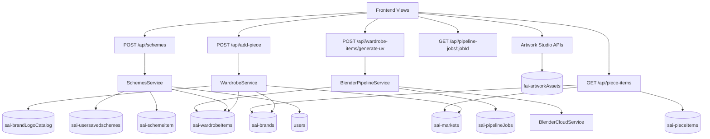
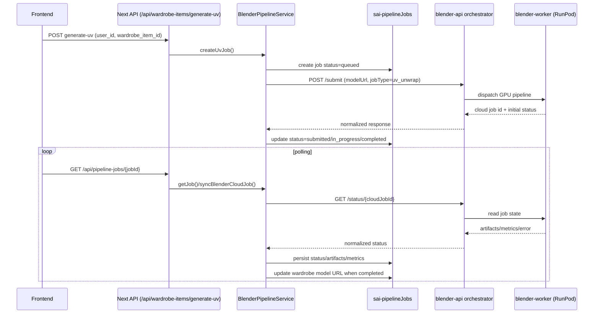
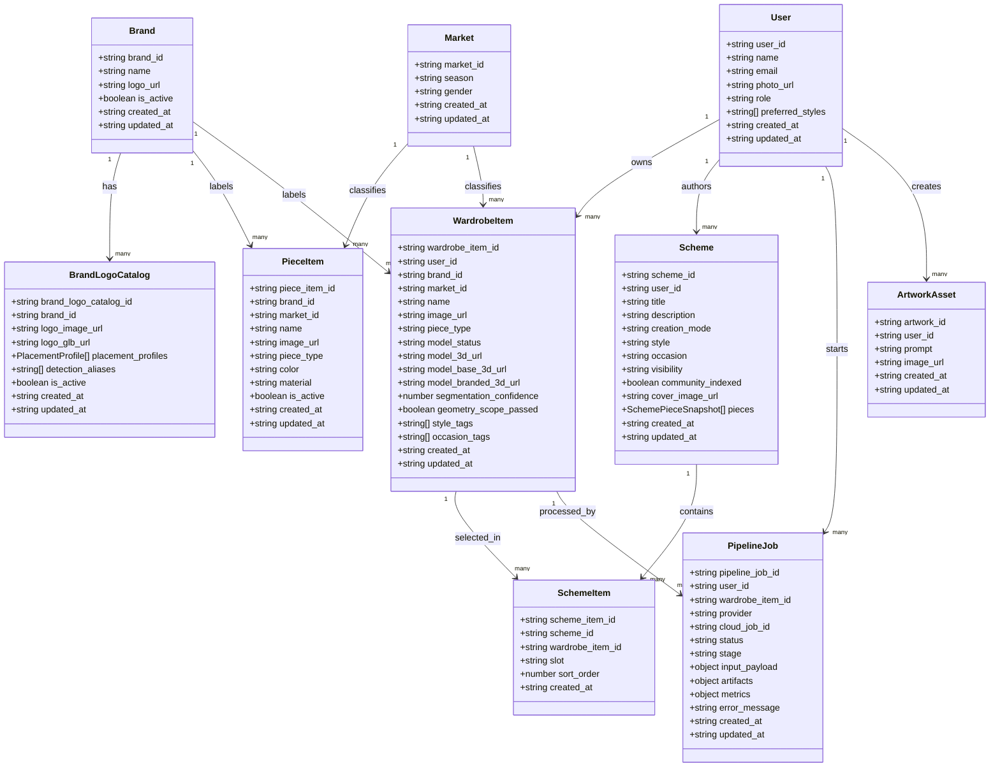
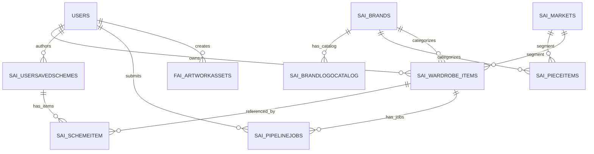

# Project Collections, API Connections, and Pipeline Architecture

This document describes the **main overall workflow ("workout")** of each important collection used in the project, how data connects to backend API services, and how the Blender + RunPod pipeline works.

It also includes:
- **Class diagrams** for main collections/documents.
- **DB-relational (ER) diagrams** for practical relationships used by services.

---

## 1) Main Firestore Collections Used by the Project

Based on repository layer constants, the main collections are:

- `users`
- `sai-brands`
- `sai-brandLogoCatalog`
- `sai-markets`
- `sai-pieceItems`
- `sai-wardrobeItems`
- `sai-usersavedschemes`
- `sai-schemeitem`
- `sai-pipelineJobs`
- `fai-artworkAssets`

> Note: This project uses Firestore (document DB). “Relational” links are maintained in application logic with IDs (not hard DB foreign keys).

---

## 2) Collection-by-Collection Workflow and API Connections

### 2.1 `users`

**Purpose**
- Stores profile information used to identify authors/creators and account context.

**Main fields (logical)**
- `user_id`, `name`, `email`, `photo_url`, `role`, `preferred_styles`, timestamps.

**Where it is used**
- `UsersRepository.getById`.
- Wardrobe discovery enriches `creator_name` with user data.
- Scheme detail resolves author name.

**API/Service connection**
- Accessed by user routes and by services that need user attribution.

---

### 2.2 `sai-brands`

**Purpose**
- Master brand catalog (active/inactive, display metadata).

**Main fields**
- `brand_id`, `name`, `logo_url`, `is_active`, timestamps.

**Where it is used**
- Wardrobe and piece search map `brand_id` to human name.
- Brand detection/placement pipeline resolves a target brand.

**API/Service connection**
- `GET /api/brands` and brand-related flows.
- Used by `BrandsService`, `WardrobeService`, and search/discovery paths.

---

### 2.3 `sai-brandLogoCatalog`

**Purpose**
- Stores logo assets and placement profiles used in brand application stage for 3D generation.

**Main fields**
- `brand_logo_catalog_id`, `brand_id`, `logo_image_url`, `logo_glb_url`, `placement_profiles[]`, aliases, `is_active`, timestamps.

**Where it is used**
- Brand placement service to choose profile by piece type.
- Branding stage of model generation.

**API/Service connection**
- `GET/PUT` style operations via brand logo catalog route.
- Used indirectly by wardrobe 3D enrichment pipeline.

---

### 2.4 `sai-markets`

**Purpose**
- Stores market dimensions (season + gender) reused by items.

**Main fields**
- `market_id`, `season`, `gender`, timestamps.

**Where it is used**
- Piece and wardrobe records reference `market_id`.
- Search filters and UI labels derive season/gender from this collection.

**API/Service connection**
- `GET /api/markets`.
- Used in `PieceItemsRepository` and `WardrobeItemsRepository` enrichment.

---

### 2.5 `sai-pieceItems`

**Purpose**
- Curated catalog inventory (suggested/store items), distinct from user-owned wardrobe.

**Main fields**
- `piece_item_id`, `brand_id`, `market_id`, name/image, `piece_type`, material/color, store info, `is_active`.

**Where it is used**
- Search recommendations and suggestion feeds.

**API/Service connection**
- `GET /api/piece-items` with filters.
- Returned as `PieceItemSearchResult` enriched with market/brand names.

---

### 2.6 `sai-wardrobeItems`

**Purpose**
- Core user collection for uploaded garments and generated assets.

**Main fields (high impact)**
- Ownership: `user_id`.
- Classification: `brand_id`, `market_id`, `piece_type`, style/occasion tags.
- 2D assets: raw/segmented/normalized/catalog image URLs.
- 3D assets: `model_3d_url`, `model_base_3d_url`, `model_branded_3d_url`, preview URL.
- Pipeline state: `model_status`, attempt counters, geometry/segmentation metrics, stage details, error fields.

**Where it is used**
- Wardrobe views, discovery, scheme composition, dress tester, UV generation.

**API/Service connection**
- Create: `POST /api/add-piece`.
- Read/update: `GET /api/wardrobe-items/*`, `GET /api/wardrobe/[id]`.
- Process: `/api/wardrobe/process-piece`, `/api/wardrobe/process-2d`, `/api/wardrobe-items/generate-uv`.

**Workflow summary**
1. API receives upload metadata.
2. Service creates document with initial status.
3. 2D isolation/normalization stage updates image fields.
4. 3D generation and branding/QA stages update model fields.
5. Optional UV job status sync updates final model URL.

---

### 2.7 `sai-usersavedschemes`

**Purpose**
- Stores outfit/scheme metadata authored by users.

**Main fields**
- `scheme_id`, `user_id`, title/description, style/occasion, visibility, `pieces[]` snapshots, cover image, timestamps.

**Where it is used**
- Public feed, user profile schemes, detailed scheme view.

**API/Service connection**
- `POST /api/schemes`, `GET /api/schemes/public`, `GET /api/schemes/user/[userId]`, `GET /api/schemes/[id]`.

---

### 2.8 `sai-schemeitem`

**Purpose**
- Stores composition links between a scheme and its selected pieces/slots.

**Main fields**
- `scheme_item_id`, `scheme_id`, `wardrobe_item_id` (or suggested token), `slot`, `sort_order`, `created_at`.

**Where it is used**
- Resolves ordered piece list for a saved scheme.

**API/Service connection**
- Written during scheme creation.
- Read in scheme detail APIs with wardrobe join logic.

---

### 2.9 `sai-pipelineJobs`

**Purpose**
- Tracks asynchronous UV/RunPod job lifecycle.

**Main fields**
- `pipeline_job_id`, `user_id`, `wardrobe_item_id`, provider/cloud IDs, status, stage, payload, artifacts, metrics, error, timestamps.

**Where it is used**
- Sync active jobs during wardrobe listing.
- Dedicated pipeline job status endpoint.

**API/Service connection**
- Create UV job: `POST /api/wardrobe-items/generate-uv`.
- Poll/sync: `GET /api/pipeline-jobs/[jobId]`.

---

### 2.10 `fai-artworkAssets`

**Purpose**
- Stores AI-generated artwork/background assets used in studio/scene workflows.

**Main fields**
- `artwork_id`, `user_id`, generation metadata, URLs, timestamps.

**API/Service connection**
- Artwork studio routes: generate/save/list/apply.

---

## 3) End-to-End API Connection Map

---

## 4) Blender + RunPod “Workout” API System

### 4.1 Runtime split

There are two runtimes:

1. **Orchestrator API (`blender-api`)**
   - Validates requests.
   - Submits jobs.
   - Normalizes status contract.
   - Exposes `/submit`, `/status/{jobId}`, `/health`, `/diagnostics`.

2. **GPU Worker (`blender-worker`)**
   - Executes Blender/PyTorch-intensive tasks.
   - Produces artifacts (GLB/UV outputs), metrics, and logs.

### 4.2 Submission + status lifecycle

### 4.3 Normalized terminal states

The pipeline aligns status into consistent terminal outcomes:
- `completed`
- `failed`
- `cancelled`

This avoids provider-specific ambiguity and lets UI safely render stable final states.

---

## 5) Class Diagrams for Main Collections

---

## 6) DB-Relational Diagram (Logical/Service-Level)

---

## 7) Practical Notes for Contributors

- Firestore does not enforce foreign keys; all integrity checks are in services/repositories.
- Use repository constants as source of truth for collection names.
- Keep status transitions explicit for `sai-wardrobeItems` and `sai-pipelineJobs`.
- Prefer updating this document when introducing a new collection or a new async pipeline stage.
