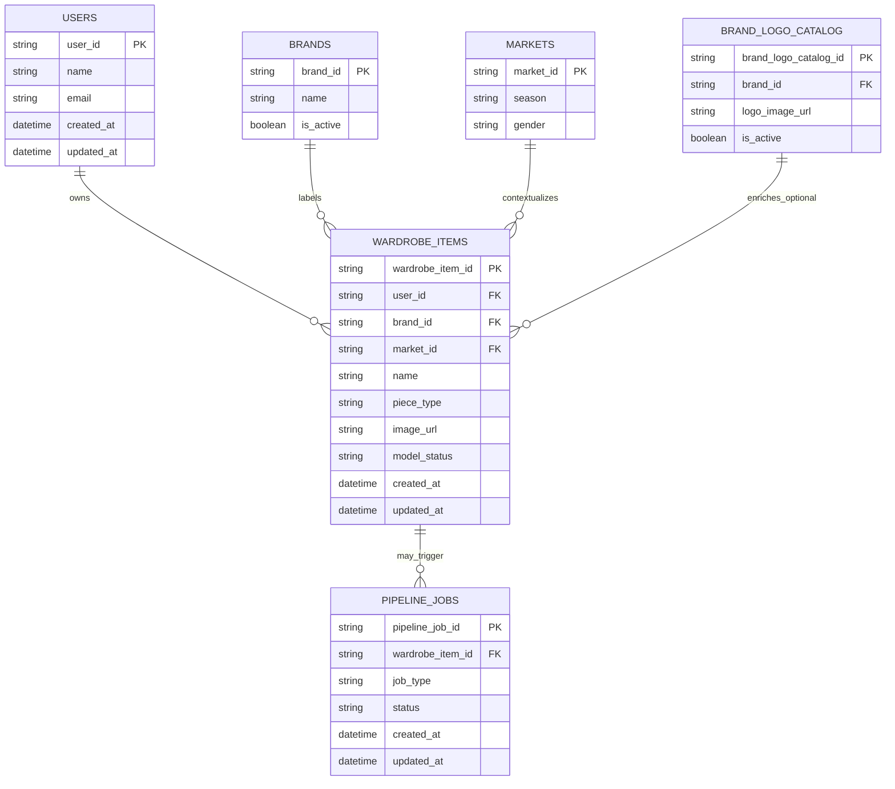
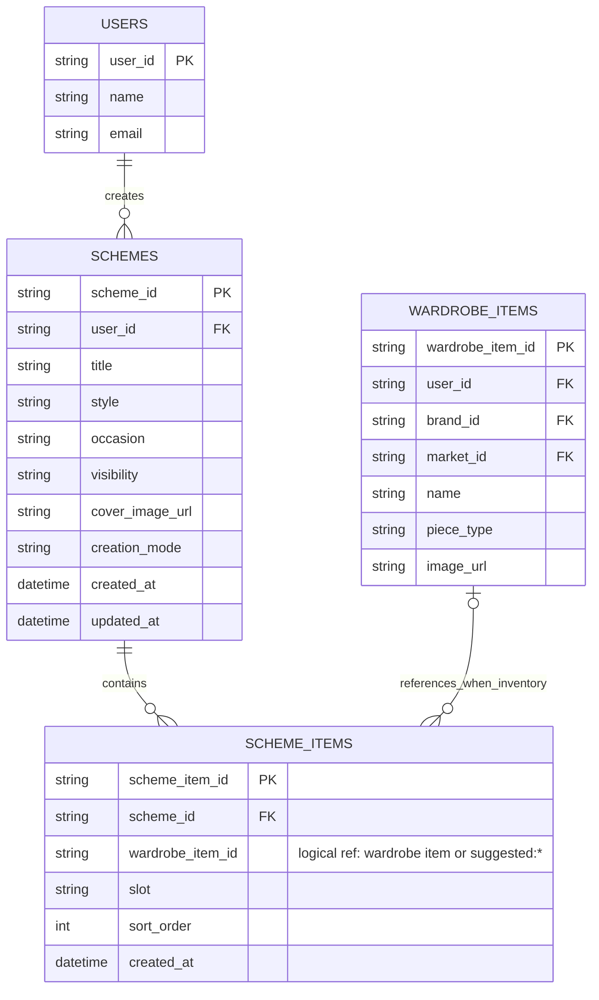
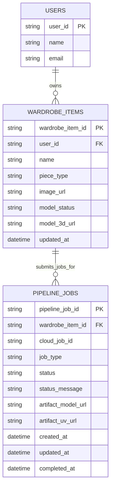

# Relational Entity Diagrams for Main Activities

This document provides **activity-oriented ER diagrams** for the three core SAI flows:

1. Create a new wardrobe piece.
2. Create and save an outfit card (scheme).
3. Execute and track the 3D pipeline.

For a quick legend of ER cardinality link symbols (`||`, `o|`, `|{`, `o{`), see [Cardinality Linking Symbols](./cardinality-linking-symbols.md).

---

## 1) Activity: Create a New Wardrobe Piece

---

## 2) Activity: Create and Save an Outfit Card (Scheme)

---

## 3) Activity: Execute and Track the 3D Pipeline

---

## Notes

- Cardinalities reflect current service/repository behavior and API payload contracts.
- Some references are intentionally **logical** (not always strict FK), especially `scheme_items.wardrobe_item_id`.
- The 3D pipeline is modeled as a one-to-many relation from `wardrobe_items` to `pipeline_jobs` to preserve job history.
