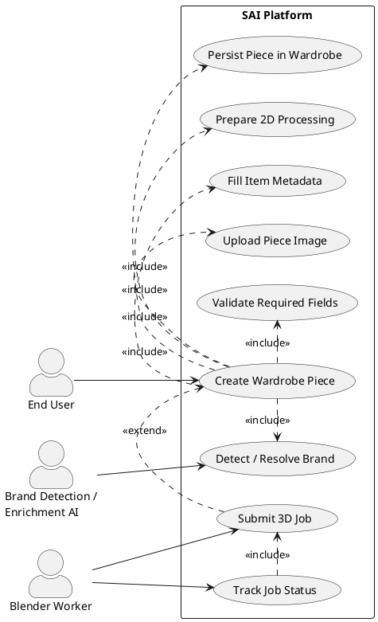
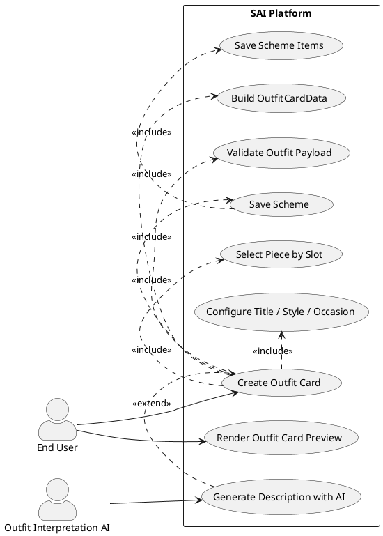
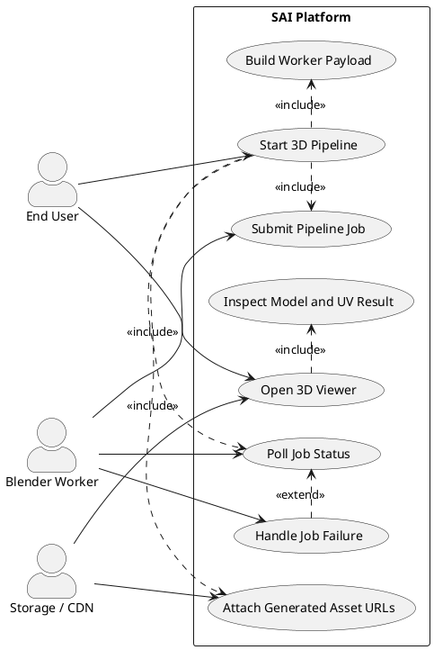

# UML Actor Diagrams — Main Project Activities

This document provides **actor-focused UML use case diagrams** for each main activity of the SAI project, following the same style as your sample (actors outside the system boundary, use cases inside, with `<<include>>` and `<<extend>>` relations).

Main activities covered:
1. Create a new wardrobe piece.
2. Create and save an outfit card (scheme).
3. Run and monitor the 3D pipeline.

---

## 1) Main Activity: Create a New Wardrobe Piece

### Actors
- **End User**: fills item form and submits the new piece.
- **Brand Detection/Enrichment AI**: helps classify and enrich metadata.
- **Blender Worker**: receives optional 3D processing jobs.

---

## 2) Main Activity: Create and Save an Outfit Card (Scheme)

### Actors
- **End User**: configures outfit slots, style, and metadata.
- **Outfit Interpretation AI**: optional prompt-based recommendation helper.

---

## 3) Main Activity: Execute 3D Pipeline and Visualization

### Actors
- **End User**: requests generation and checks progress/results.
- **Blender Worker**: executes UV/model processing jobs.
- **Storage/CDN**: serves generated artifacts back to the app.

---

## Notes
- These are **actor/use-case diagrams** only (not sequence diagrams), intentionally matching the visual intent of your screenshot.
- If you want, I can generate a second version with stricter UML relation semantics (for example, avoiding `<<include>>` from optional technical substeps).
- These diagrams are ready to render in PlantUML-compatible tools.
