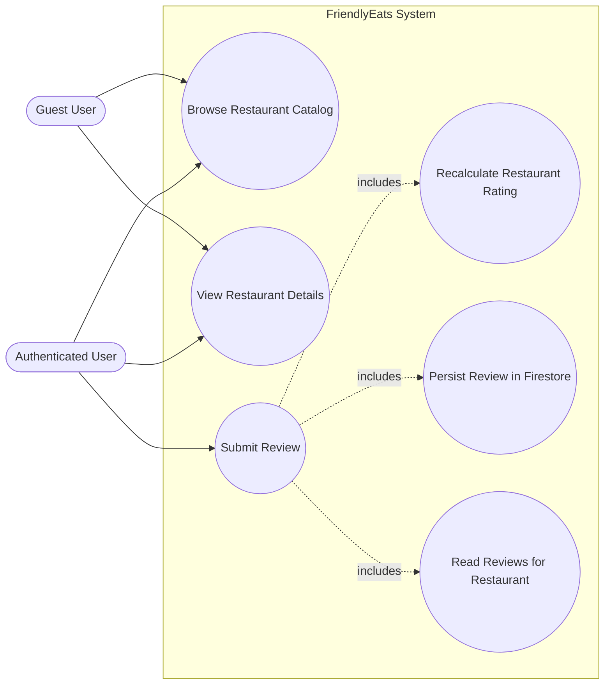
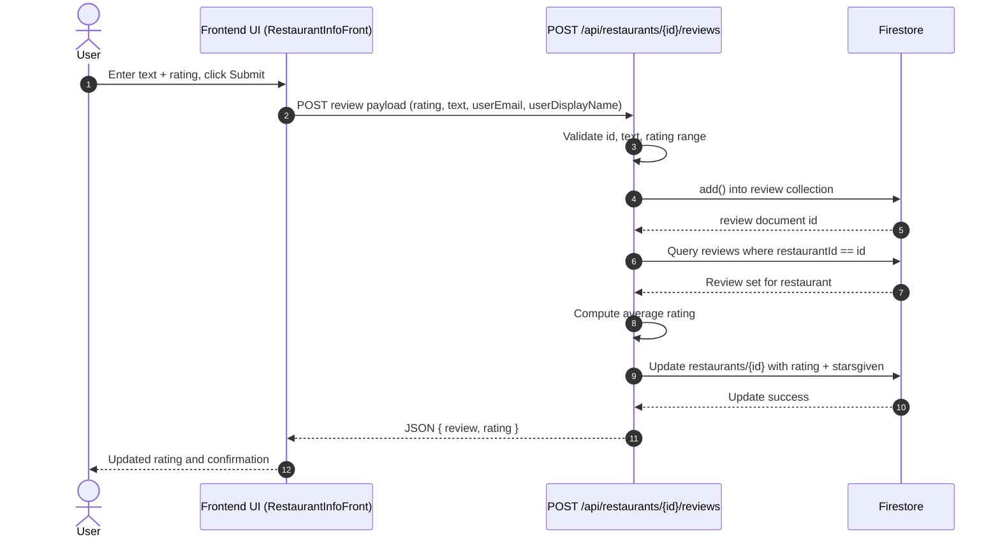
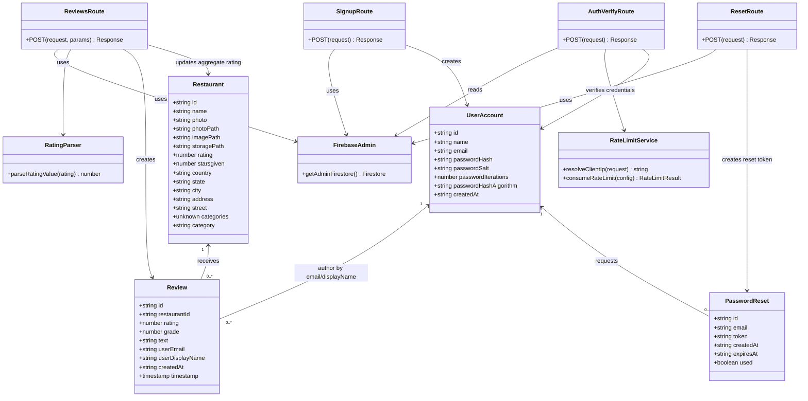
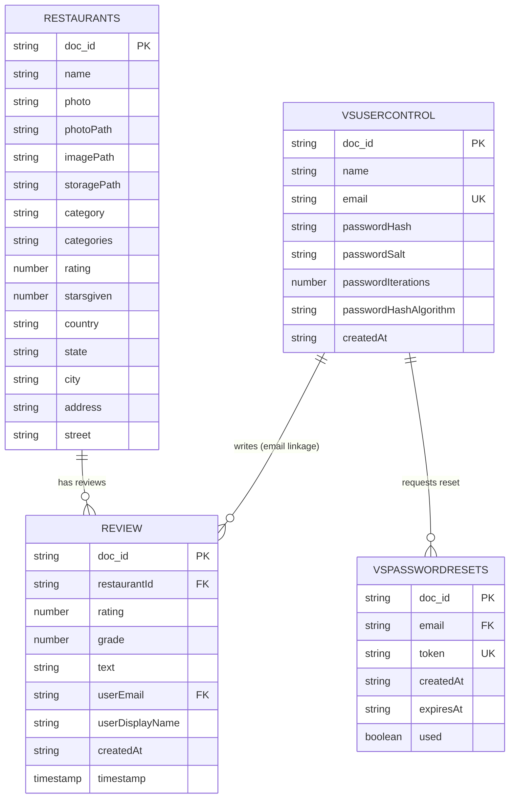

# System UML & Data Model Diagrams

This document provides:

1. A **main-use-case UML view** of the system.
2. A **class diagram** for the core backend/domain elements.
3. An **ER diagram** for the Firestore-backed data model.

The diagrams are based on the current API routes, shared libraries, and domain types in this repository.

---

## 1) Main Use Case UML — Submit Restaurant Review

### 1.1 Use Case Diagram

### 1.2 Sequence Diagram (Main Use Case Realization)

---

## 2) UML Class Diagram — Core Domain + Backend Services

---

## 3) ER Diagram — Firestore Collections

---

## 4) Notes and Assumptions

- Firestore is schemaless; ER attributes represent fields observed in route handlers and domain types.
- `REVIEW.userEmail` and `VSPASSWORDRESETS.email` are **logical foreign keys** (application-level linkage).
- Restaurant aggregate rating is denormalized in `restaurants.rating` and `restaurants.starsgiven` and recalculated after review insert.
